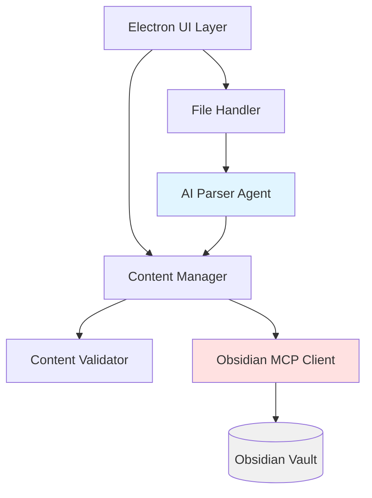

# Design Document: Resume Content Ingestion

## Overview

The Resume Content Ingestion system is an Electron-based desktop application that transforms traditional resume documents into a structured, queryable knowledge base stored in an Obsidian vault. The system uses AI agents (powered by OpenAI or Anthropic SDKs) to intelligently parse resume documents and extract atomic content items with rich metadata and hierarchical relationships.

The architecture follows a clear separation of concerns:
- **Electron UI Layer**: Provides the desktop interface for file uploads, content review, and manual entry
- **AI Agent Layer**: Handles intelligent parsing and content extraction using LLM capabilities
- **Storage Layer**: Manages persistence through the Obsidian MCP tool
- **Business Logic Layer**: Coordinates parsing, validation, and content management

This design prioritizes flexibility (handling varied resume formats), atomicity (storing independent content items), and relationships (maintaining job-to-content hierarchies) to enable future resume generation and content querying capabilities.

## Architecture

### System Components



### Component Responsibilities

**Electron UI Layer**
- File upload interface with drag-and-drop support
- Content review and editing interface
- Manual content entry forms
- Search and filter interface
- Error display and user feedback

**File Handler**
- File format validation (PDF, DOCX, TXT)
- File size validation (< 10MB)
- Text extraction from different formats
- Error handling for corrupted or invalid files

**AI Parser Agent**
- Resume structure analysis using LLM
- Content extraction and categorization
- Hierarchical relationship detection
- Confidence scoring for extractions
- Fallback handling for ambiguous content

**Content Manager**
- Content item creation and updates
- Tag management and application
- Metadata attachment and validation
- Duplicate detection
- Relationship management between content items

**Content Validator**
- Required field validation
- Data format validation
- Relationship integrity checks
- Tag format validation

**Obsidian MCP Client**
- Interface to Obsidian MCP tool
- Markdown file creation and updates
- YAML frontmatter management
- Tag and link syntax handling
- Query execution for search operations

### Data Flow

**Resume Upload Flow**:
1. User uploads resume file → File Handler validates format and size
2. File Handler extracts text → AI Parser Agent analyzes structure
3. Parser extracts content items with relationships → Content Manager receives parsed data
4. Content Manager applies tags and metadata → User reviews in UI
5. User confirms → Content Manager saves via Obsidian MCP Client → Vault stores markdown files

**Manual Entry Flow**:
1. User fills form → Content Validator checks required fields
2. Validator passes → Content Manager creates content item with tags
3. Content Manager saves via Obsidian MCP Client → Vault stores markdown file

**Search Flow**:
1. User enters search criteria → Content Manager builds query
2. Query sent to Obsidian MCP Client → MCP tool searches vault
3. Results returned → UI displays matching content items

## Components and Interfaces

### File Handler

```typescript
interface FileHandler {
  validateFile(file: File): ValidationResult;
  extractText(file: File): Promise<string>;
  getSupportedFormats(): string[];
}

interface ValidationResult {
  isValid: boolean;
  errorMessage?: string;
  fileSize: number;
  format: FileFormat;
}

enum FileFormat {
  PDF = 'pdf',
  DOCX = 'docx',
  TXT = 'txt'
}
```

### AI Parser Agent

The parser uses OpenAI or Anthropic SDKs with structured output to extract content:

```typescript
interface ParserAgent {
  parseResume(text: string): Promise<ParsedResume>;
  extractJobEntries(text: string): Promise<JobEntry[]>;
  extractSkills(text: string, context?: JobEntry): Promise<Skill[]>;
  extractAccomplishments(text: string, context?: JobEntry): Promise<Accomplishment[]>;
}

interface ParsedResume {
  jobEntries: JobEntry[];
  education: Education[];
  certifications: Certification[];
  skills: Skill[];
  confidence: ConfidenceScore;
  warnings: ParsingWarning[];
}

interface JobEntry {
  id: string;
  title: string;
  company: string;
  location: Location;
  duration: DateRange;
  accomplishments: Accomplishment[];
  skills: Skill[];
  confidence: number;
}

interface ConfidenceScore {
  overall: number;
  bySection: Map<string, number>;
}

interface ParsingWarning {
  section: string;
  message: string;
  severity: 'low' | 'medium' | 'high';
}
```

**Parser Implementation Strategy**:
- Use structured output mode (JSON schema) to ensure consistent extraction
- Provide few-shot examples in system prompt for common resume formats
- Use chain-of-thought prompting for ambiguous sections
- Implement retry logic with refined prompts for low-confidence extractions
- Fall back to section-by-section parsing if full resume parsing fails

### Content Manager

```typescript
interface ContentManager {
  createContentItem(item: ContentItemInput): Promise<ContentItem>;
  updateContentItem(id: string, updates: Partial<ContentItem>): Promise<ContentItem>;
  deleteContentItem(id: string): Promise<void>;
  linkContentItems(parentId: string, childId: string): Promise<void>;
  searchContentItems(query: SearchQuery): Promise<ContentItem[]>;
  detectDuplicates(item: ContentItemInput): Promise<ContentItem[]>;
}

interface ContentItemInput {
  type: ContentType;
  content: string;
  tags: string[];
  metadata: ContentMetadata;
  parentId?: string;
}

interface ContentItem extends ContentItemInput {
  id: string;
  createdAt: Date;
  updatedAt: Date;
  filePath: string;
}

enum ContentType {
  JOB_TITLE = 'job-title',
  JOB_LOCATION = 'job-location',
  JOB_DURATION = 'job-duration',
  SKILL = 'skill',
  ACCOMPLISHMENT = 'accomplishment',
  EDUCATION = 'education',
  CERTIFICATION = 'certification',
  JOB_ENTRY = 'job-entry'
}

interface ContentMetadata {
  dateRange?: DateRange;
  location?: Location;
  company?: string;
  proficiency?: string;
  notes?: string;
  customFields?: Record<string, any>;
}

interface SearchQuery {
  tags?: string[];
  text?: string;
  dateRange?: DateRange;
  contentType?: ContentType;
}
```

### Obsidian MCP Client

```typescript
interface ObsidianMCPClient {
  writeNote(path: string, content: string, frontmatter: Frontmatter): Promise<void>;
  readNote(path: string): Promise<NoteContent>;
  updateNote(path: string, content: string, frontmatter?: Frontmatter): Promise<void>;
  deleteNote(path: string): Promise<void>;
  searchNotes(query: ObsidianQuery): Promise<NoteSearchResult[]>;
  listDirectory(path: string): Promise<string[]>;
}

interface Frontmatter {
  tags: string[];
  type: ContentType;
  createdAt: string;
  updatedAt: string;
  metadata: ContentMetadata;
  parentId?: string;
  childIds?: string[];
}

interface NoteContent {
  path: string;
  content: string;
  frontmatter: Frontmatter;
}

interface ObsidianQuery {
  tags?: string[];
  searchContent?: boolean;
  searchFrontmatter?: boolean;
  query?: string;
}
```

## Data Models

### Vault Directory Structure

```
obsidian-vault/
├── resume-content/
│   ├── jobs/
│   │   ├── job-entry-{id}.md          # Parent job entry
│   │   └── job-entry-{id}/
│   │       ├── accomplishments/
│   │       │   └── accomplishment-{id}.md
│   │       └── skills/
│   │           └── skill-{id}.md
│   ├── education/
│   │   └── education-{id}.md
│   ├── certifications/
│   │   └── certification-{id}.md
│   └── standalone-skills/
│       └── skill-{id}.md
```

### Markdown File Format

**Job Entry Example**:
```markdown
---
tags: [job-entry, software-engineer]
type: job-entry
createdAt: 2024-01-15T10:30:00Z
updatedAt: 2024-01-15T10:30:00Z
metadata:
  company: Acme Corp
  location:
    city: San Francisco
    state: CA
    country: USA
  dateRange:
    start: 2020-01-01
    end: 2023-06-30
childIds:
  - accomplishment-abc123
  - accomplishment-def456
  - skill-xyz789
---

# Senior Software Engineer at Acme Corp

**Duration**: January 2020 - June 2023
**Location**: San Francisco, CA

## Related Content
- [[accomplishment-abc123]]
- [[accomplishment-def456]]
- [[skill-xyz789]]
```

**Accomplishment Example**:
```markdown
---
tags: [accomplishment, performance-optimization]
type: accomplishment
createdAt: 2024-01-15T10:31:00Z
updatedAt: 2024-01-15T10:31:00Z
parentId: job-entry-xyz123
metadata:
  company: Acme Corp
  dateRange:
    start: 2021-03-01
    end: 2021-06-30
---

# Performance Optimization Achievement

Reduced API response time by 60% through database query optimization and caching implementation, improving user experience for 100K+ daily active users.

**Parent Job**: [[job-entry-xyz123]]
```

**Skill Example**:
```markdown
---
tags: [skill, programming-language, typescript]
type: skill
createdAt: 2024-01-15T10:32:00Z
updatedAt: 2024-01-15T10:32:00Z
parentId: job-entry-xyz123
metadata:
  proficiency: expert
  company: Acme Corp
  dateRange:
    start: 2020-01-01
    end: 2023-06-30
---

# TypeScript

Expert-level proficiency in TypeScript for building scalable backend services and type-safe APIs.

**Applied at**: [[job-entry-xyz123]]
```

### Type Definitions

```typescript
interface DateRange {
  start: string; // ISO 8601 date
  end?: string;  // ISO 8601 date, undefined for current
}

interface Location {
  city?: string;
  state?: string;
  country?: string;
}

interface Skill {
  id: string;
  name: string;
  proficiency?: string;
  parentJobId?: string;
  tags: string[];
}

interface Accomplishment {
  id: string;
  description: string;
  parentJobId: string;
  dateRange?: DateRange;
  tags: string[];
}

interface Education {
  id: string;
  degree: string;
  institution: string;
  location?: Location;
  dateRange: DateRange;
  tags: string[];
}

interface Certification {
  id: string;
  name: string;
  issuer: string;
  dateIssued: string;
  expirationDate?: string;
  tags: string[];
}
```


## Correctness Properties

*A property is a characteristic or behavior that should hold true across all valid executions of a system—essentially, a formal statement about what the system should do. Properties serve as the bridge between human-readable specifications and machine-verifiable correctness guarantees.*

### Property Reflection

After analyzing all acceptance criteria, I identified several areas of redundancy:

**Consolidated Properties**:
- Requirements 4.1-4.7 (tag application for each content type) can be consolidated into a single property about type-to-tag mapping
- Requirements 3.1-3.7 (extraction of different content types) can be consolidated into a property about content extraction completeness
- Requirements 1.1-1.3 (accepting different file formats) can be consolidated into a single property about valid format acceptance
- Requirement 5.4 and 7.5 are identical (updating markdown files)
- Requirement 11.6 and 12.4 are similar (maintaining relationships through links)

**Properties Covering Multiple Requirements**:
- File validation properties cover both format and size validation (1.1-1.5)
- Storage round-trip properties cover creation, update, and deletion (5.1, 5.4, 5.5)
- Search properties cover multiple search criteria types (9.1-9.4)

### File Validation Properties

**Property 1: Valid file formats are accepted**
*For any* file with a supported format (PDF, DOCX, TXT) and size under 10MB, the file handler should accept the file and return a successful validation result.
**Validates: Requirements 1.1, 1.2, 1.3, 1.5**

**Property 2: Invalid file formats are rejected**
*For any* file with an unsupported format, the file handler should reject the file and return an error message indicating the invalid format.
**Validates: Requirements 1.4**

**Property 3: Oversized files are rejected**
*For any* file with size >= 10MB, the file handler should reject the file and return an error message indicating the size limit.
**Validates: Requirements 1.5**

### Parsing Properties

**Property 4: Parser provides confidence scores**
*For any* parsed resume, the parser output should include confidence scores for each extracted section.
**Validates: Requirements 2.5**

**Property 5: Content extraction completeness**
*For any* resume containing identifiable content of a given type (job title, skill, accomplishment, education, certification), the parser should extract that content as a separate content item.
**Validates: Requirements 3.1, 3.2, 3.3, 3.4, 3.5, 3.6, 3.7**

### Tagging Properties

**Property 6: Content type to tag mapping**
*For any* content item of a specific type, the system should apply the corresponding tag (#job-title, #skill, #accomplishment, #education, #certification, #job-location, #job-duration).
**Validates: Requirements 4.1, 4.2, 4.3, 4.4, 4.5, 4.6, 4.7**

**Property 7: Multiple tag support**
*For any* content item with multiple applicable tags, all tags should be applied to the content item.
**Validates: Requirements 4.8**

### Storage Properties

**Property 8: Content item storage round-trip**
*For any* content item created, a corresponding markdown file should exist in the vault at the expected path, and reading that file should return equivalent content and metadata.
**Validates: Requirements 5.1, 5.3**

**Property 9: Obsidian tag syntax compliance**
*For any* stored content item with tags, the markdown file should use Obsidian's native tag syntax (tags in YAML frontmatter array).
**Validates: Requirements 5.2**

**Property 10: Content update persistence**
*For any* content item update, the markdown file should reflect the changes, and reading the file should return the updated content.
**Validates: Requirements 5.4, 7.5**

**Property 11: Content deletion removes file**
*For any* content item deletion, the corresponding markdown file should no longer exist in the vault.
**Validates: Requirements 5.5**

**Property 12: Creation timestamp preservation**
*For any* content item update, the createdAt timestamp should remain unchanged from the original creation time.
**Validates: Requirements 7.6**

### Validation Properties

**Property 13: Required field validation**
*For any* manual entry submission with missing required fields (content type, content text), the system should reject the submission and return validation errors.
**Validates: Requirements 6.2, 6.5**

**Property 14: Valid manual entry creates content item**
*For any* valid manual entry with all required fields populated, the system should create a new content item with the specified content and appropriate tags.
**Validates: Requirements 6.6**

**Property 15: Invalid submission prevents creation**
*For any* invalid manual entry submission, the system should display validation errors and not create a content item.
**Validates: Requirements 6.7**

### Metadata Properties

**Property 16: YAML frontmatter structure**
*For any* content item with metadata, the markdown file should contain valid YAML frontmatter with all metadata fields properly structured.
**Validates: Requirements 8.6**

### Search Properties

**Property 17: Tag-based search accuracy**
*For any* search query with tag filters, all returned results should contain all specified tags, and no items with those tags should be omitted.
**Validates: Requirements 9.1, 9.4**

**Property 18: Text search accuracy**
*For any* text-based search query, all returned results should contain the search text in their content, and no items containing that text should be omitted.
**Validates: Requirements 9.2**

**Property 19: Date range filtering**
*For any* search with a date range filter, all returned results should have date ranges that overlap with the specified range, and no items within that range should be omitted.
**Validates: Requirements 9.3**

**Property 20: Search results completeness**
*For any* search result, the returned content item should include all tags and metadata associated with that item.
**Validates: Requirements 9.5**

### MCP Integration Properties

**Property 21: Consistent markdown structure**
*For any* content item stored in the vault, the markdown file should follow the defined structure (YAML frontmatter + content + links section).
**Validates: Requirements 10.1**

**Property 22: Machine-readable frontmatter**
*For any* content item stored in the vault, the YAML frontmatter should be parseable by standard YAML parsers without errors.
**Validates: Requirements 10.2**

**Property 23: Tag format for programmatic access**
*For any* content item with tags, the tags should be stored in the frontmatter tags array in a format that the MCP tool can query.
**Validates: Requirements 10.3**

**Property 24: Content retrieval by type**
*For any* content type query via MCP tool, all content items of that type should be retrievable, and no items of other types should be returned.
**Validates: Requirements 10.4**

### Hierarchical Relationship Properties

**Property 25: Job entry parent creation**
*For any* parsed job experience, a parent job entry content item should be created before any child items (accomplishments, skills).
**Validates: Requirements 11.1**

**Property 26: Accomplishment-to-job linking**
*For any* accomplishment associated with a job, the accomplishment's markdown file should contain a parentId reference to the job entry, and the job entry should list the accomplishment in its childIds.
**Validates: Requirements 11.2**

**Property 27: Skill-to-job linking**
*For any* skill associated with a job, the skill's markdown file should contain a parentId reference to the job entry, and the job entry should list the skill in its childIds.
**Validates: Requirements 11.3**

**Property 28: Date range association**
*For any* job entry, the date range in the metadata should match the parsed employment dates for that job.
**Validates: Requirements 11.4**

**Property 29: Title association**
*For any* job entry, the title should match the parsed job title for that position.
**Validates: Requirements 11.5**

**Property 30: Obsidian link preservation**
*For any* parent-child relationship between content items, both the parent and child markdown files should contain Obsidian links ([[child-id]] in parent, [[parent-id]] in child).
**Validates: Requirements 11.6, 12.4**

**Property 31: Hierarchical context in queries**
*For any* content item query that returns a child item (accomplishment, skill), the result should include the parentId indicating which job entry it belongs to.
**Validates: Requirements 11.7**

### Atomicity Properties

**Property 32: Original resume not stored**
*For any* resume parsing operation, the vault should not contain the original resume file after parsing completes.
**Validates: Requirements 12.1**

**Property 33: Independent content item storage**
*For any* content item, it should be stored as a separate markdown file that can be read and retrieved independently of other content items.
**Validates: Requirements 12.2**

**Property 34: Duplicate content prevention**
*For any* two content items with identical content text and type, only one should exist in the vault (or they should have different metadata justifying separate storage).
**Validates: Requirements 12.3**

**Property 35: Many-to-many skill relationships**
*For any* skill that was used in multiple jobs, the skill's markdown file should contain references to all applicable job entries.
**Validates: Requirements 12.5**

### Review and Confirmation Properties

**Property 36: Review confirmation saves all items**
*For any* review confirmation action, all content items in the review state should be saved to the vault with their relationships intact.
**Validates: Requirements 13.6**

**Property 37: Review cancellation discards content**
*For any* review cancellation action, no content items from that review session should be saved to the vault.
**Validates: Requirements 13.7**

### Error Handling Properties

**Property 38: Upload failure error messages**
*For any* file upload failure, the system should display an error message that indicates the specific cause of the failure.
**Validates: Requirements 15.1**

**Property 39: Parsing error logging and continuation**
*For any* parsing error encountered during resume processing, the error should be logged with details, and parsing should continue for remaining sections.
**Validates: Requirements 15.2**

**Property 40: Validation error highlighting**
*For any* validation failure on a form, the system should indicate which specific fields failed validation.
**Validates: Requirements 15.3**

**Property 41: Success confirmation display**
*For any* successfully completed operation (save, update, delete), the system should display a confirmation message to the user.
**Validates: Requirements 15.5**

**Property 42: Unexpected error handling**
*For any* unexpected error, the system should display a user-friendly error message and log technical details for debugging.
**Validates: Requirements 15.6**

## Error Handling

### Error Categories

**File Handling Errors**:
- Invalid file format → Display format error, suggest supported formats
- File too large → Display size error with limit information
- File corrupted → Display corruption error, suggest re-upload
- File read failure → Display I/O error, check file permissions

**Parsing Errors**:
- AI agent timeout → Retry with exponential backoff, fallback to section-by-section parsing
- AI agent rate limit → Queue request, display wait message
- Low confidence extraction → Flag items for user review, allow manual correction
- Complete parsing failure → Log error, allow manual entry of all content

**Storage Errors**:
- Vault unavailable → Display connection error, prevent data loss by caching locally
- Write permission denied → Display permission error, suggest vault configuration
- Disk space full → Display storage error, suggest cleanup
- Concurrent modification → Detect conflicts, prompt user to resolve

**Validation Errors**:
- Missing required fields → Highlight fields, display specific requirements
- Invalid date format → Display format error with example
- Invalid metadata → Display validation error with correction suggestions

### Error Recovery Strategies

**Graceful Degradation**:
- If AI parsing fails completely, fall back to manual entry mode
- If specific sections fail to parse, allow manual entry for those sections only
- If vault is temporarily unavailable, cache operations locally and sync when available

**User Feedback**:
- All errors display user-friendly messages (no stack traces in UI)
- Technical details logged to file for debugging
- Actionable suggestions provided where possible
- Progress indicators for long-running operations

**Data Integrity**:
- All write operations are atomic (complete or rollback)
- Validation occurs before any persistence
- Backup mechanism for critical operations
- Conflict detection for concurrent edits

## Testing Strategy

### Dual Testing Approach

The system requires both unit tests and property-based tests for comprehensive coverage:

**Unit Tests**: Focus on specific examples, edge cases, and integration points
- Test specific resume formats (PDF, DOCX, TXT)
- Test UI component rendering and interactions
- Test error conditions with specific inputs
- Test integration between components
- Test real resume parsing with actual documents (Requirement 14)

**Property-Based Tests**: Verify universal properties across all inputs
- Test file validation with randomly generated files
- Test content item operations with random data
- Test search functionality with random queries
- Test relationship preservation with random hierarchies
- Minimum 100 iterations per property test

### Property-Based Testing Configuration

**Framework**: Use `fast-check` for TypeScript property-based testing

**Test Structure**:
```typescript
// Example property test
import fc from 'fast-check';

describe('Feature: resume-content-ingestion, Property 1: Valid file formats are accepted', () => {
  it('should accept all files with supported formats under 10MB', () => {
    fc.assert(
      fc.property(
        fc.record({
          format: fc.constantFrom('pdf', 'docx', 'txt'),
          size: fc.integer({ min: 1, max: 10 * 1024 * 1024 - 1 }),
          content: fc.uint8Array({ minLength: 1, maxLength: 1000 })
        }),
        (file) => {
          const result = fileHandler.validateFile(file);
          expect(result.isValid).toBe(true);
          expect(result.errorMessage).toBeUndefined();
        }
      ),
      { numRuns: 100 }
    );
  });
});
```

**Test Tagging**: Each property test must include a comment referencing the design property:
```typescript
// Feature: resume-content-ingestion, Property 8: Content item storage round-trip
```

**Coverage Requirements**:
- Each correctness property must have exactly one property-based test
- Property tests should run minimum 100 iterations
- Unit tests should cover specific examples and edge cases not covered by properties
- Integration tests should use real resume files (Requirement 14)

### Test Data Strategy

**Generators for Property Tests**:
- File generator: random formats, sizes, content
- Content item generator: random types, content, metadata
- Date range generator: valid and invalid ranges
- Tag generator: valid Obsidian tag formats
- Hierarchy generator: random parent-child relationships

**Real Resume Test Data** (Requirement 14):
- Collect 3-5 real resume files in each format (PDF, DOCX, TXT)
- Ensure variety in formatting styles and structures
- Include resumes with different section orders
- Include resumes with varying levels of detail
- Test parsing accuracy against manually verified ground truth

### Integration Testing

**End-to-End Flows**:
1. Upload resume → Parse → Review → Save → Verify in vault
2. Manual entry → Validate → Save → Verify in vault
3. Search by tags → Verify results → Verify completeness
4. Update content → Verify persistence → Verify timestamp preservation
5. Delete content → Verify removal from vault

**MCP Tool Integration**:
- Test vault operations through Obsidian MCP tool
- Verify markdown format compatibility
- Test query operations for content retrieval
- Verify tag-based filtering

### Performance Testing

**Benchmarks**:
- File upload and validation: < 1 second for files up to 10MB
- Resume parsing: < 30 seconds for typical resume (2-3 pages)
- Content item save: < 500ms per item
- Search operations: < 2 seconds for vault with 1000+ items

**Load Testing**:
- Test with large resumes (10+ years of experience)
- Test with vaults containing 5000+ content items
- Test concurrent operations (multiple saves, searches)

