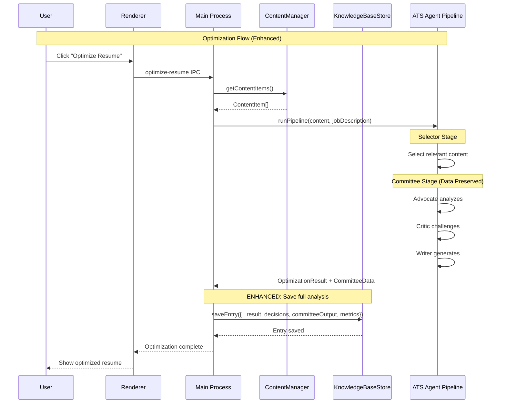

# Design Document: Resume Vault System (Option A - Enhanced Existing Architecture)

## Overview

The Resume Vault System enhances the existing optimization workflow by **persisting committee analysis** and **tracking optimization decisions** in the Knowledge Base. This provides audit trails and transparency into optimization choices without restructuring the content storage layer.

### Design Decision

After analyzing the existing codebase, we chose **Option A: Enhance existing architecture** rather than implementing a new hierarchical vault structure. The reasons:

1. **Content storage works** - The current `ContentManager` with Obsidian integration is functional
2. **Committee analysis is the gap** - Rich `AdvocateAnalysis` and `CriticAnalysis` data is computed but discarded
3. **Minimal disruption** - Extends existing `KnowledgeBaseEntry` rather than replacing core storage
4. **Immediate value** - Users can see why content was included/excluded in their optimized resumes

---

## Current Architecture (Preserved)

### Content Storage Model

The existing system uses a flat content type model with parent-child relationships:

```
resume-content/
├── job_entry/           # Work experience entries
├── accomplishment/      # Bullet points linked to jobs via parentId
├── skill/               # Skills (can have parentId for skill groups)
├── education/           # Education entries
└── certification/       # Certifications
```

Each item is stored as an Obsidian markdown file with YAML frontmatter containing:
- `id` - UUID for stable referencing
- `type` - Content type (job_entry, accomplishment, skill, etc.)
- `parentId` - Links children to parents (accomplishments → job_entry)
- `createdAt`, `updatedAt` - Timestamps
- Type-specific metadata (company, title, dates, etc.)

**Key Files:**
- `src/main/contentManager.ts` - ContentManagerImpl with in-memory Map and file persistence
- `src/types/index.ts` - ContentItem interface definition
- `src/shared/obsidian/types.ts` - Frontmatter structure for Obsidian files

### Knowledge Base (Current)

Stores optimization results as markdown files:

```
KnowledgeBase/
├── Anthropic-SDE-2024-12-15.md
├── Google-ML-Engineer-2024-12-10.md
└── ...
```

**Current `KnowledgeBaseEntry` fields:**
- `id`, `timestamp`, `vaultPath`
- `jobTitle`, `company`, `jobDescription`
- `optimizedResume` - The generated resume text
- `fitScore` - Final optimization score

**Gap:** Committee analysis (AdvocateAnalysis, CriticAnalysis, decisions) is computed during optimization but **not persisted**.

---

## Enhanced Architecture (Option A Changes)

### Extended KnowledgeBaseEntry

```typescript
export interface KnowledgeBaseEntry {
  // === EXISTING FIELDS (unchanged) ===
  id: string;
  timestamp: string;
  vaultPath: string;
  jobTitle: string;
  company: string;
  jobDescription: string;
  optimizedResume: string;
  fitScore: number;

  // === NEW FIELDS (Option A additions) ===

  /**
   * Parsed structure of job requirements for better filtering/display
   */
  parsedRequirements?: ParsedRequirements;

  /**
   * Tracks what content was included, excluded, or modified during optimization
   */
  decisions?: OptimizationDecisions;

  /**
   * Preserved committee analysis for transparency into optimization reasoning
   */
  committeeOutput?: CommitteeOutput;

  /**
   * Performance metrics for debugging and optimization
   */
  metrics?: OptimizationMetrics;
}

interface ParsedRequirements {
  required: string[];           // Must-have qualifications
  preferred: string[];          // Nice-to-have qualifications
  skills: string[];             // Technical/soft skills mentioned
  experience: string | null;    // Years of experience requirement
  education: string | null;     // Degree requirements
}

interface OptimizationDecisions {
  includedItems: Array<{
    itemId: string;             // UUID of vault content item
    reason: string;             // Why included (e.g., "Directly addresses ML experience requirement")
  }>;
  excludedItems: Array<{
    itemId: string;
    reason: string;             // Why excluded (e.g., "Unrelated to target role")
  }>;
  modifiedItems: Array<{
    originalContent: string;    // Before modification
    modifiedContent: string;    // After modification
    keywordsAdded: string[];    // Terms injected for ATS matching
    rationale: string;          // Why this modification was made
  }>;
}

interface CommitteeOutput {
  // Aggregate scores
  advocateFitScore: number;     // Advocate's assessment (0-1)
  criticFitScore: number;       // Critic's assessment (0-1)

  // Process metadata
  rounds: number;               // How many committee iterations
  terminationReason: 'consensus' | 'target_reached' | 'max_rounds' | 'no_improvement';

  // Advocate findings
  connections: Array<{
    requirement: string;        // Job requirement addressed
    evidence: string;           // Resume content that addresses it
    strength: 'strong' | 'moderate' | 'inferred' | 'transferable';
  }>;
  strengths: string[];          // Key strengths identified

  // Critic findings
  challenges: Array<{
    type: 'overclaim' | 'unsupported' | 'missing' | 'weak_evidence' | 'terminology_gap' | 'blandification';
    claim: string;              // What was challenged
    issue: string;              // Why it's problematic
    severity: 'critical' | 'major' | 'minor';
  }>;
  genuineGaps: Array<{
    requirement: string;        // Requirement not met
    reason: string;             // Why it's a genuine gap
    isRequired: boolean;        // Is this a must-have?
  }>;
}

interface OptimizationMetrics {
  durationMs: number;           // Total optimization time
  tokenUsage: {
    advocate: number;
    critic: number;
    writer: number;
    total: number;
  };
}
```

### Data Flow (Enhanced)



---

## Component Changes

### 1. KnowledgeBaseStore Enhancement

**File:** `src/main/knowledgeBaseStore.ts`

Changes:
- Extend `KnowledgeBaseEntry` interface with new optional fields
- Update `save()` to persist new fields to markdown frontmatter
- Update `load()` to parse new fields from existing entries
- Maintain backward compatibility (new fields are optional)

### 2. ATS Agent Pipeline Enhancement

**File:** `src/ats-agent/pipeline.ts`

Changes:
- Return full committee data from pipeline execution
- Structure return value to include:
  - Optimization result (existing)
  - Advocate analysis (preserve instead of discarding)
  - Critic analysis (preserve instead of discarding)
  - Decision tracking (what was included/excluded and why)
  - Performance metrics (timing, tokens)

### 3. Renderer Integration

**File:** `src/renderer/optimizer.js`

Changes:
- Update `saveToKnowledgeBase()` to pass full committee result
- Receive and forward the enhanced data structure

### 4. Knowledge Base UI Enhancement (Optional)

**Files:** `src/renderer/knowledge-base.js`, `src/renderer/knowledge-base.html`

Changes:
- Add expandable section in detail modal for committee analysis
- Display:
  - Advocate connections (requirement → evidence mapping)
  - Critic challenges with severity badges
  - Genuine gaps identified
  - Decision audit trail (included/excluded items)

---

## Backward Compatibility

All new fields are **optional**, ensuring:

1. **Existing entries load correctly** - Old entries without new fields work fine
2. **No migration required** - New fields appear only on new optimizations
3. **Graceful degradation** - UI hides sections when data is absent

```typescript
// Safe access pattern
const connections = entry.committeeOutput?.connections ?? [];
const decisions = entry.decisions?.includedItems ?? [];
```

---

## File Mapping

| Requirement | File | Change Type |
|-------------|------|-------------|
| Persist committee analysis | `src/main/knowledgeBaseStore.ts` | Extend interface |
| Return committee data | `src/ats-agent/pipeline.ts` | Modify return type |
| Pass data to save | `src/renderer/optimizer.js` | Pass through |
| Display analysis | `src/renderer/knowledge-base.js` | New UI section |
| Display analysis | `src/renderer/knowledge-base.html` | New UI elements |

---

## Testing Strategy

### Unit Tests

**KnowledgeBaseStore:**
- Save entry with all new fields
- Save entry with partial new fields (optional)
- Load legacy entry without new fields
- Load enhanced entry with all fields
- Filter by new parsed requirements

**Pipeline:**
- Verify committee data is returned
- Verify decisions are captured
- Verify metrics are tracked

### Integration Tests

```typescript
describe('Enhanced Optimization Flow', () => {
  it('should persist committee analysis to knowledge base', async () => {
    // Run optimization
    const result = await runOptimization(content, jobDescription);

    // Verify committee data returned
    expect(result.committeeOutput).toBeDefined();
    expect(result.committeeOutput.connections.length).toBeGreaterThan(0);
    expect(result.decisions.includedItems.length).toBeGreaterThan(0);

    // Save to knowledge base
    await knowledgeBaseStore.save(result);

    // Reload and verify persistence
    const loaded = await knowledgeBaseStore.get(result.id);
    expect(loaded.committeeOutput).toEqual(result.committeeOutput);
    expect(loaded.decisions).toEqual(result.decisions);
  });

  it('should maintain backward compatibility with legacy entries', async () => {
    // Load entry created before enhancement
    const legacyEntry = await knowledgeBaseStore.get(legacyId);

    // New fields should be undefined, not cause errors
    expect(legacyEntry.committeeOutput).toBeUndefined();
    expect(legacyEntry.decisions).toBeUndefined();

    // Core fields should work
    expect(legacyEntry.optimizedResume).toBeDefined();
    expect(legacyEntry.fitScore).toBeDefined();
  });
});
```

### Manual Testing

1. Run optimization with committee enabled
2. Verify Knowledge Base entry contains:
   - Parsed requirements
   - Decision tracking
   - Committee analysis
   - Performance metrics
3. Existing entries should still load
4. UI should display new analysis sections

---

## Implementation Sequence

1. **Phase 1: Backend Types** - Extend `KnowledgeBaseEntry` interface
2. **Phase 2: Pipeline Changes** - Return committee data from ATS agent
3. **Phase 3: Integration** - Connect renderer to pass data through
4. **Phase 4: UI (Optional)** - Display committee analysis in detail modal
5. **Phase 5: Verification** - Test with real optimizations

---

## Why Not Hierarchical Vault?

The original spec proposed a hierarchical `Vault` with `Section → Object → Item` structure. Analysis of the codebase revealed:

| Aspect | Hierarchical Vault | Current System |
|--------|-------------------|----------------|
| Content storage | New `vault.json` | Existing Obsidian files |
| Relationships | Nested arrays | `parentId` links |
| Migration | Required | None |
| Risk | High (major refactor) | Low (additive changes) |
| Value | Implicit context | Already works |

The **main value of the spec is in the optimization outputs** (committee analysis, decisions, audit trails), not in restructuring content storage. Option A delivers this value with minimal disruption.
